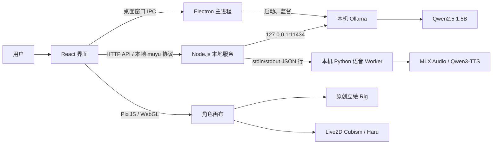

# 当前桌面萌宠技术栈与架构说明

> 项目版本：`1.14.0`
> 整理日期：2026-09-29
> 依据：当前仓库的 `package.json`、`package-lock.json`、`README.md`、前后端源码及现有技术说明。本文描述代码中实际采用的方案；本地模型和 Python 运行时属于随应用准备的资源，不是 npm 依赖。

## 一句话概览

这是一个以 **React + Vite** 构建界面、以 **Electron** 提供 macOS 桌面窗口、以 **Node.js 内置 HTTP 服务**连接前端与本地推理的桌面陪伴应用。聊天默认调用本机 **Ollama + Qwen2.5 1.5B**；语音合成使用随应用携带的 **MLX Audio + Qwen3-TTS**；角色画面由 **PixiJS** 渲染，其中原创衣橱角色采用立绘网格形变，Haru 使用真正的 **Live2D Cubism** 模型。

## 技术栈总览

| 层 | 技术 | 本项目中的用途 |
|---|---|---|
| 桌面界面 | React、React DOM、JSX、CSS | 主界面、衣橱、聊天、设置、专注、回忆、桌宠交互 |
| 前端构建 | Vite、`@vitejs/plugin-react` | 本地开发服务器、React 转换、生产静态资源构建 |
| 桌面容器 | Electron | macOS 原生窗口、置顶/小窗/全屏、透明桌宠、应用菜单和打包 |
| 本机应用服务 | Node.js、原生 `http`、ES Modules | 静态文件、聊天/模型/语音 API、输入校验和本地请求限制；没有采用 Express 等 Web 框架 |
| 桌宠绘制 | PixiJS、WebGL、GLSL | 2D 立绘网格动画、面部着色、动作帧和透明画布 |
| Live2D 渲染 | `pixi-live2d-display`、Live2D Cubism Core | Haru 的 Cubism 模型、预制动作、表情、物理摆动和目光跟随 |
| 本地聊天 | Ollama、Qwen2.5 1.5B | 在本机生成中文对话；模型不可用时使用应用内规则回复 |
| 本地语音 | Python、MLX Audio 0.5.6、Qwen3-TTS-12Hz-0.6B-Base-8bit | 参考音色语音合成，支持分段流式输出和音色选择 |
| 本地语音识别 | Web Speech API；音色制作时另有 MLX Audio STT | 麦克风输入使用浏览器语音识别接口；导入音色时可在本机转写参考录音 |
| 本地存储 | `localStorage`、IndexedDB、应用数据目录 | 保存聊天和设置、导入媒体、音色库等，不依赖云端数据库 |
| 自动化检查 | Node.js 内置 `node:test`、jsdom、Testing Library | 项目提供单元、服务、前端和桌面行为测试 |

### npm 依赖版本

下表中的“声明范围”来自 `package.json`，“锁定版本”来自当前 `package-lock.json`。运行 `npm install` 时应以锁文件为准。

| 包 | 声明范围 | 锁定版本 | 类型 |
|---|---:|---:|---|
| `react` | `^19.1.0` | `19.3.0` | 运行时 |
| `react-dom` | `^19.1.0` | `19.3.0` | 运行时 |
| `vite` | `^7.1.0` | `7.3.6` | 开发/构建 |
| `@vitejs/plugin-react` | `^5.0.0` | `5.2.0` | 开发/构建 |
| `electron` | `^41.0.0` | `41.10.7` | 桌面运行时 |
| `pixi.js` | `6.5.10` | `6.5.10` | 2D/WebGL 渲染 |
| `pixi-live2d-display` | `0.4.0` | `0.4.0` | Live2D 渲染集成 |
| `@pixi/unsafe-eval` | `6.5.10` | `6.5.10` | Pixi shader 与严格 CSP 的兼容绑定 |
| `@phosphor-icons/react` | `^2.1.10` | `2.1.10` | 图标 |
| `@electron/packager` | `^19.0.0` | `19.1.1` | macOS 应用打包 |
| `@testing-library/react` | `^16.3.3` | `16.3.3` | 前端测试 |
| `jsdom` | `^26.1.0` | `26.1.0` | DOM 测试环境 |
| `prettier` | `^3.9.9` | `3.9.9` | 格式化工具 |

Ollama、Qwen 模型、MLX、Python 和 Cubism Core 不在 npm 包依赖列表内：它们分别通过本机/应用运行时、Python 虚拟运行环境或 `public/` 静态资源提供。

## 运行架构



### 桌面启动过程

1. Electron 主进程读取应用资源目录，先检查生产界面 `dist/index.html`。
2. `electron/runtime.cjs` 查找随应用提供的 Ollama 可执行文件；若本机 Ollama 尚未运行，则在回环地址启动并监督它。
3. `server/index.mjs` 启动 Node 本地服务。默认监听 `127.0.0.1:4317`；端口被占用时桌面版改用系统分配的空闲端口。
4. Electron 注册 `muyu://app/` 自定义协议，将渲染层请求转发给该本地服务。这样桌面页面使用稳定的应用来源，聊天存储不会依赖随机本地端口。
5. Electron 创建透明能力的无边框窗口，加载 React 页面；渲染层通过预加载脚本暴露的有限 API 调用窗口操作。
6. 退出应用时，Electron 关闭它自己管理的本地服务和 Ollama 子进程。

浏览器开发模式由 Vite 提供页面，`/api` 请求代理至本机 Node 服务。浏览器版和桌面版的浏览器存储彼此独立。

## 主要模块

| 路径 | 责任 |
|---|---|
| `src/App.jsx` | React 主界面与顶层状态：聊天、设置、造型选择、专注计时、回忆、窗口模式和 API 调用 |
| `src/WardrobePage.jsx` | 独立全身衣柜工作台：人物选择、改名、完整造型、部件元数据、角色语料和背景 |
| `src/PetShell.jsx` | 透明桌宠布局、拖动入口、桌宠衣橱和精简聊天框 |
| `src/LivePet.jsx` | 根据造型选择原创 Pixi 角色或 Haru Live2D；管理画布生命周期、动画、互动与资源释放 |
| `src/GlamPet.jsx` | 原创角色的立绘渲染：网格、着色器、眨眼、表情、口型、鼠标视线和动作帧 |
| `src/glam-motion.mjs`、`src/portrait-mouth.mjs` | 原创立绘 rig 解析、姿态形变、动作队列和嘴部变形计算 |
| `src/live2d-motion.mjs` | Haru 的动作映射、表情、口型参数与模型适配 |
| `src/state.mjs` | 本地应用状态的默认值、读取校正、消息与收藏处理 |
| `server/wardrobe.mjs`、`src/wardrobe.mjs` | 共享的人物、合身造型、九类服装槽位、日韩穿搭配方、白色比基尼安全底装与背景目录 |
| `src/audio.js`、`src/speech-stream.mjs` | 调用朗读 API、取消语音、音频流分段排程、播放电平采集和雨声音频 |
| `src/media.mjs` | IndexedDB 中导入媒体的读写 |
| `server/index.mjs` | 原生 HTTP 服务、API 路由、静态文件服务、安全响应头和输入校验 |
| `server/dialogue.mjs` | 离线场景回复、能力边界回复、造型/动作指令解析及模型提示消息 |
| `server/ollama.mjs` | 查询本机模型并调用 Ollama 对话接口 |
| `server/voice.mjs`、`server/speech-worker.mjs` | TTS 服务、模型预热、流式合成、缓存、取消和 Python 子进程管理 |
| `server/voice-library.mjs` | 参考录音校验、音色的创建/选择/改名/删除与本地保存 |
| `electron/main.cjs` | 原生窗口生命周期、系统菜单、快捷键、桌宠模式、置顶、缩放和 IPC 校验 |
| `electron/preload.cjs` | 用 `contextBridge` 暴露少量桌面窗口方法；不向 React 暴露 Node.js 访问权 |
| `electron/runtime.cjs` | 启动、健康检查、故障恢复和关闭本应用管理的 Ollama 实例 |
| `scripts/` | 浏览器启动/停止、模型准备、macOS `.app` 打包和素材辅助脚本 |

## 角色渲染与动画

应用有两类动态角色实现，不能把所有角色都称作 Live2D：

### 原创衣橱角色：PixiJS 立绘网格动画

- `public/looks/` 保存原创角色的 PNG 立绘和各自的 `rig.json`。当前目录含 42 套造型；目录清单与角色说明见 `docs/wardrobe-expansion.md` 和 `public/looks/ATTRIBUTION.md`。
- 人物和服装使用独立稳定 ID。用户改名、每人语料、最后使用造型与衣柜背景保存在原有 `muyu-state-v1` 中；旧全局语料在读取时迁移到当前角色，不改存储键。
- 衣服部件是可复用元数据，实际显示仍使用 ImageGen 为目标人物生成的完整合身 PNG。未生成的跨人物组合会标记待适配，不在运行时直接叠图。
- `GlamPet` 用 PixiJS 将静态立绘作为纹理映射到细分平面网格，再用自定义顶点与片元着色器产生轻微呼吸、转头、视线、眨眼、脸颊表情和说话时嘴部形变。
- 林薇两套造型另外带有下蹲图和四帧走姿图，作为动作时段内的画面叠层/帧切换。
- 这是对二维图片做实时变形和局部着色，不是 Cubism rig、三维模型、逐音素口型或视频生成。

### Haru：真正的 Live2D Cubism 模型

- Haru 使用 `public/live2d/haru/` 中的 `.moc3`、贴图、物理、姿势、动作和表情文件，由 `pixi-live2d-display` 加载。
- Cubism Core 放在 `public/vendor/live2dcubismcore.min.js`，渲染所需文件随应用本地加载，不从 CDN 下载。
- 动作和表情来自随模型提供的预设；音频口型由当前朗读音频电平驱动，鼠标位置驱动目光控制器。
- Haru 样例、Cubism Core 和 Pixi 渲染器有各自的版权/许可范围，不能将它们都视为同一种 MIT 许可。细节见 `docs/live2d-attribution.md` 与随包许可证。

所有角色口型按当前音频振幅响应，不做精确音素对齐。角色动作限于已有程序逻辑、动作图和 Live2D 预设，不代表可任意生成舞蹈、走路或真人视频。

## 聊天与本地模型

聊天调用路径为：React 页面 `POST /api/chat` → Node 服务校验 → 离线规则或 Ollama。本地聊天模型配置为 `qwen2.5:1.5b`，Ollama 默认 API 地址是 `http://127.0.0.1:11434`。文本对话请求采用非流式响应；模型上下文取最近一段消息，并有生成长度和超时限制。

在请求模型前，代码会检查当前用户输入中的已知角色能力、动作和换装指令。可确定的动作/能力说明由本地规则直接回复；模型不可用时，也会返回明确的本地场景互动，不把规则回复伪装成大模型输出。聊天 API 的 `provider` 目前是 `offline` 或 `ollama`；前端的 `auto` 表示按本机可用模型选择。

Node 服务对请求做 JSON 类型、长度、造型 ID 和模型名校验，只绑定回环接口，并校验 `Host` 与 `Origin`。主要接口如下：

| 方法与路径 | 功能 |
|---|---|
| `GET /api/health` | 本机服务、模型和语音可用状态 |
| `GET /api/models` | 查询本机 Ollama 模型列表 |
| `POST /api/chat` | 场景回复或本地模型聊天 |
| `GET/POST /api/voices` | 列出音色、导入并保存音色 |
| `POST /api/voices/select` | 选择当前音色 |
| `POST /api/voices/rename` | 修改自定义音色名称 |
| `POST /api/voices/delete` | 删除自定义音色 |
| `POST /api/tts` | 返回 WAV，或返回 NDJSON 格式的流式音频片段 |

## 语音输入、语音合成与口型

### 语音输入

前端麦克风按钮使用浏览器的 `SpeechRecognition` / `webkitSpeechRecognition` 接口。具体支持情况由当前浏览器和系统决定；麦克风权限或识别不可用时仍可用键盘。此浏览器接口可能依赖网络服务，所以不能把麦克风转写概括为始终离线。

### 语音合成

- 正常内置参考音色使用 MLX Audio 0.5.6 和 Qwen3-TTS-12Hz-0.6B-Base-8bit；Mac 端随运行时携带 Python 和模型文件，代码设置离线加载环境变量。
- 语音 Worker 通过标准输入/输出交换 JSON 行，不额外开放网络端口。可以预热模型、复用进程、缓存音频、排队和响应取消。
- 前端请求流式朗读时，服务端以 NDJSON 发送 WAV 片段；浏览器使用 Web Audio API 在同一音频时钟上排程片段，避免等待整段生成后才开始播放。
- 当打包参考音色配置不存在时，macOS 可使用系统 `/usr/bin/say` 的中文声音分支。若参考音色配置存在但资源损坏，服务会报告不可用，不会静默将其替换成系统声音。
- 添加用户音色时，录音片段和台词保存在本机；留空台词可由本机 MLX Audio STT（项目说明中列为 Qwen3-ASR-0.6B-4bit）尝试识别。音色库修改会在本地用户数据目录中保留。

口型通过 Web Audio `AnalyserNode` 读取正在播放音频的波形/电平，再交给 `GlamPet` 或 Live2D 参数更新。合成音频不会保存为聊天音频历史文件。

## 数据保存位置

| 数据 | 保存方式 | 说明 |
|---|---|---|
| 聊天、偏好、场景、所选角色、收藏、语料 | 浏览器 `localStorage`，键为 `muyu-state-v1` | 最近消息最多 200 条；收藏单独保存；桌面版与浏览器版相互独立 |
| 自定义图片/视频 | IndexedDB 数据库 `muyu-media`，对象仓库 `assets` | Blob 与文件类型/名称保存在本机浏览器配置中 |
| 用户音色和当前选择 | macOS 应用数据目录下的 `voice-library/` | Electron 保留既有 `沐语` userData 目录，升级改名后继续使用 |
| 语音合成过程 | 进程内存及有上限的短期缓存 | 不作为聊天记录写入音频文件 |
| Ollama 模型 | `.runtime/models/` | 桌面打包脚本要求模型清单已准备好；由本机 Ollama 加载 |

聊天历史和设置不会自动同步到其他设备。导入内容的持久化位置与 Electron 应用配置、浏览器配置相关。

## Electron 桌面能力与安全边界

- 桌面版通过 Electron 原生 `BrowserWindow` 实现普通窗口、紧凑小窗、透明置顶桌宠、全屏、拖动、忽略鼠标事件和系统菜单快捷键。
- 渲染进程启用 `contextIsolation`、`sandbox`、`webSecurity`，并关闭 `nodeIntegration`。预加载只暴露窗口控制和状态监听方法；所有 IPC 都验证发送者是当前主窗口。
- 外部 HTTP/HTTPS 链接交给系统浏览器打开；不允许渲染页面任意导航到其他站点。桌面权限请求处理器当前统一拒绝。
- Node 服务只监听本机回环地址，并设置 CSP、安全响应头、请求来源校验和静态文件路径检查。
- Ollama 设置 `OLLAMA_NO_CLOUD=1`，模型通过回环地址访问。聊天与 TTS 推理在本机进行；麦克风的 Web Speech 识别是前述例外。

## 开发、运行与打包

项目 `package.json` 中提供以下命令：

```bash
npm install
npm run dev          # Vite 前端开发服务器，默认 127.0.0.1:5173
npm run build        # 构建到 dist/
npm run server       # 启动本地 Node 服务
npm start            # 启动浏览器版本地服务并打开页面
npm run stop         # 停止由 npm start 启动的服务
npm run desktop      # 启动 Electron 桌面开发版
npm test             # 运行 tests/*.test.mjs
npm run package      # 构建前端并打包 macOS .app 与本地运行资源
```

打包由 `@electron/packager` 完成，`scripts/build-desktop.mjs` 当前只允许在 macOS 上构建；输出架构跟随构建机器的 `process.arch`。打包前必须已有 `dist/`、本地 Ollama 可执行文件和模型清单。仓库说明记录的开发构建环境要求为 Node.js 22.12+ 或 20.19+，但 `package.json` 本身没有声明 `engines` 字段。

浏览器备用启动由项目 Node 脚本托管服务。桌面应用启动时则由 Electron 主进程直接创建后端服务，并独立管理它启动的本地推理引擎。

## 目录速查

```text
src/                 React 页面、Pixi 角色、状态、音频、样式
server/              Node 本地 API、离线对话、Ollama、TTS 与音色库
electron/            Electron 主进程、预加载 API、本地引擎管理
scripts/             启动、停止、构建打包与素材工具
public/looks/        原创角色立绘、Rig 和动作画面
public/live2d/       Haru Cubism 模型、动作、表情与许可证
public/vendor/       本地 Cubism Core
public/assets/       四套图片场景
tests/               Node 测试、前端/服务/渲染逻辑回归检查
docs/                设计、验收、模型来源和工作流记录
.runtime/            本机模型、Ollama 与语音 Python 运行时（不作为普通源码目录）
```

## 需要准确理解的边界

1. **“桌宠透明置顶”是 Electron 窗口能力**，由原生窗口设置、预加载 IPC 和 React 桌宠界面共同实现。
2. **原创 42 套角色造型不是 42 个 Live2D 模型**；它们是 PNG 立绘配 Rig 数据，由 PixiJS 做局部网格动画。Haru 才是 Cubism 模型。
3. **“本地 AI”指聊天与语音推理使用本机运行时和模型**。麦克风识别使用 Web Speech API，可能受浏览器实现和网络影响。
4. **动作是程序预设或资源帧**；语音口型按音频响度跟随，不是逐字/逐音素同步，也不支持任意动作或自动生成新视频。
5. **主应用没有独立云端账户或远程数据库**。会话数据存在当前设备；桌面与浏览器环境不会自动互通。

## 相关文档

- [项目使用说明](../README.md)
- [Live2D 来源与许可](live2d-attribution.md)
- [参考音色说明](reference-voice.md)
- [音色库说明](voice-library.md)
- [流式语音说明](voice-speed-1.6.md)
- [动态衣橱扩展记录](wardrobe-expansion.md)
- [桌面及功能验收记录](verification.md)
